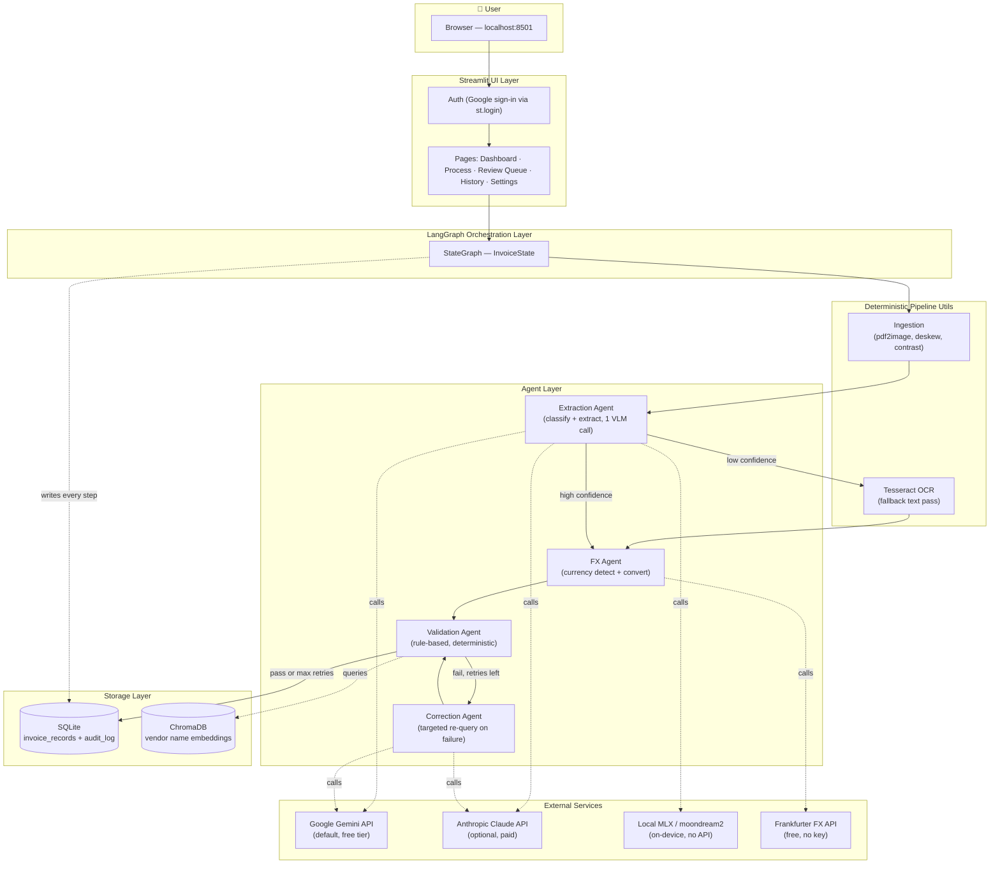
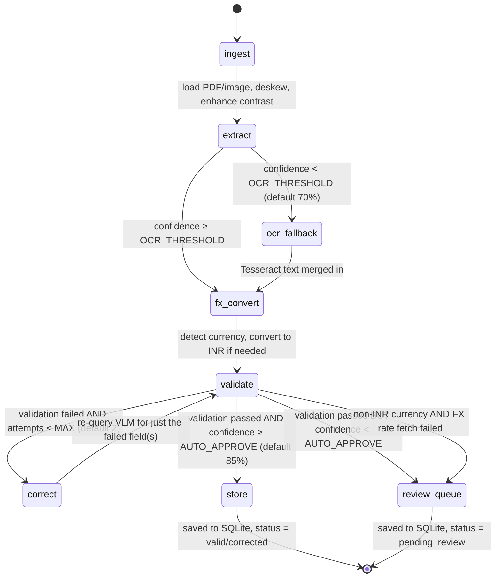
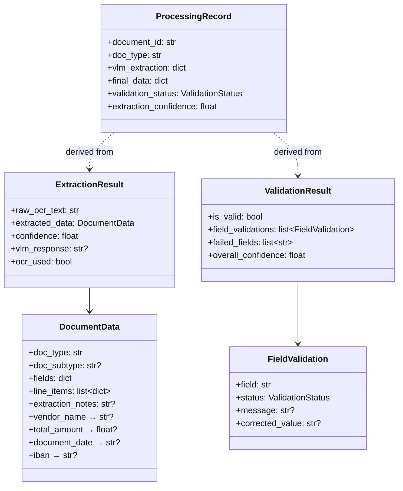

# Doc Agent — Architecture & Product Notes

_Living document. Update this as the product evolves — treat it as the source of truth you'd walk an interviewer, a new engineer, or a stakeholder through._

Last updated: 2026-07-03 (Tier 1-3 roadmap items shipped, repo prepped for public deployment, real Google auth + per-user encrypted API keys added — see §13-14)

---

## 1. What This Product Does

**Doc Agent** is a multi-agent AI system that turns unstructured documents — invoices, receipts, purchase orders, bank statements, forms — into structured, validated, database-ready data, with automatic error-correction and a human-in-the-loop safety net for anything the AI isn't confident about.

**The problem it solves:** finance/ops teams manually re-key data from PDFs and scanned images into their systems (ERP, accounting software, expense tools). That's slow, error-prone, and doesn't scale. Traditional OCR only gives you raw text — it doesn't understand *which* number is the total, *which* field is the vendor, or whether the numbers even add up.

**The approach:** instead of one OCR pass, this is an **agentic pipeline** — a sequence of specialized AI/logic steps, each with one job, orchestrated as a state machine (LangGraph), with confidence scores driving automatic routing decisions:

- If the AI is confident → auto-approve and store.
- If it's uncertain → try to self-correct (re-look at the image).
- If it's still uncertain after retries → route to a human review queue instead of silently guessing.

**Who it's for:** finance/ops teams, AP (accounts payable) automation, expense management, any workflow currently bottlenecked on manual document entry.

**Current state:** working end-to-end demo — upload a document, watch it flow through the pipeline live, see extracted fields, validation results, and export as JSON/CSV. Runs locally via Streamlit; VLM backend is swappable at runtime (Gemini free tier by default, Claude/local models as alternatives).

---

## 2. Why This Architecture (the product thinking)

This is the section to lead with in an interview — it shows you're not just describing code, you're explaining *decisions*.

| Decision | Why | Alternative considered |
|---|---|---|
| **Vision-Language Model (VLM) as primary extractor, not classic OCR+regex** | Documents vary wildly in layout. A VLM reads the image *and* understands context (which number is "the total" vs "a line item price"), rather than needing per-vendor templates. | Template-based OCR (e.g. per-vendor regex) — doesn't generalize, breaks on layout changes. |
| **Schema-free extraction (`fields: dict`) instead of rigid per-doc-type Pydantic models** | The VLM extracts *whatever it finds*, using its own field names. Convenience accessors (`vendor_name`, `total_amount`, etc.) then search across common name variants (`total`, `grand_total`, `amount_due`...). This means new document types work immediately without a schema-engineering cycle. | Strict typed schema per document type — more "correct" looking, but brittle; every new vendor layout risks a validation failure. |
| **Confidence-driven routing, not binary pass/fail** | Real-world extraction confidence is a spectrum. Auto-approving everything risks silent errors reaching finance systems; routing everything to humans defeats the purpose of automation. Three-zone routing (auto-approve / OCR-assist / human review) balances automation rate against error rate — and the *threshold is a product lever*, not a hardcoded constant. | Single confidence threshold — simpler, but conflates "needs OCR help" with "needs a human." |
| **Auto-correction loop before giving up to a human** | Cheaper and faster than a human review for many failures (e.g. VLM misread a smudged digit). Re-querying with a tighter, field-specific prompt often fixes it. Capped at N attempts (default 2) so it can't loop forever. | Send every validation failure straight to review — simpler but wastes human time on fixable errors. |
| **Deterministic, rule-based validation (not LLM-as-judge)** | Checking `subtotal + tax == total`, ISO date formats, IBAN regex, and vendor-name matching don't need an LLM — they need to be fast, free, and 100% explainable/auditable. Using an LLM to "judge" correctness would be slower, non-deterministic, and harder to defend in an audit. | LLM self-critique / LLM-as-judge — trendy, but wrong tool for arithmetic and regex-shaped checks. |
| **Pluggable VLM backend, switchable at runtime from Settings** | Different backends = different cost/quality/privacy tradeoffs (see §8). A PM/user should be able to switch from a free tier to a paid model, or to a fully local/offline model, without a code deploy — this is a real cost-control and vendor-lock-in mitigation lever. | Hardcode one vendor's API — simpler, but couples the whole product to one vendor's pricing and uptime. |
| **LangGraph for orchestration** | The pipeline has branches and a retry loop (validate → correct → validate again) — a directed graph with conditional edges is the natural model, and LangGraph gives streaming (`process_document_stream`) so the UI can show live per-step progress. | Linear script with if/else — works, but doesn't give you the graph-as-state-machine mental model, streaming, or easy visualization. |
| **SQLite + audit log, not a queue/worker system** | This is a single-user local demo scale product today. SQLite + a synchronous pipeline is the right-sized choice — no infra to stand up, but every state transition is still logged to an `audit_log` table for traceability. | Celery/RQ + Postgres — correct for production multi-tenant scale, over-engineered for the current stage. |

---

## 3. High-Level System Architecture



**Layer summary:**
- **UI (Streamlit):** single-page-app-style navigation, session-state auth, 6 pages (Dashboard, Process Document, Review Queue, History, Tech Stack, Settings).
- **Orchestration (LangGraph):** a compiled state graph (`graph/workflow.py`) that owns the `InvoiceState` TypedDict and routes between nodes based on confidence/validation outcomes.
- **Agents:** the "AI" layer — VLM-backed extraction and correction, plus deterministic validation and FX conversion.
- **Pipeline utils:** non-AI preprocessing (PDF→image, deskew, contrast enhancement) and OCR fallback.
- **External services:** the VLM providers (swappable) and a free FX rate API.
- **Storage:** SQLite for records + full audit trail; ChromaDB (vector DB) scoped narrowly to one job — semantic vendor-name matching.

---

## 4. The Core Pipeline — LangGraph State Machine

This is the heart of the product. Every document flows through this graph. Each node updates a shared `InvoiceState` object; edges (some conditional) decide what runs next.



### Node-by-node

| Node | What it does | Fails over to |
|---|---|---|
| **`ingest`** | Converts PDF pages to images (`pdf2image` @ 300 DPI) or loads a single image file. Applies deskew (OpenCV) and contrast/sharpness enhancement (Pillow). | — |
| **`extract`** | **The core AI step.** One VLM call does *both* document-type classification and full field extraction — see §5 for why this is one call instead of two. Returns a confidence score (see §7 for how it's computed). | — |
| **`ocr_fallback`** | Only runs if extraction confidence is below the OCR threshold. Runs Tesseract OCR on the image and merges the text with the VLM output to fill gaps. | — |
| **`fx_convert`** | Detects the document's currency from extracted fields (symbol or field values). If non-INR, fetches a live rate from a free FX API and converts every monetary field + line item to INR. If the currency is unknown, assumes INR. If the rate fetch fails, flags the document for mandatory human review. | Human review if FX fetch fails |
| **`validate`** | Deterministic, rule-based checks (see §6): totals reconciliation, date format, IBAN format, vendor fuzzy-match. No LLM involved — fast and explainable. | — |
| **`correct`** | For each *failed* field only, crops toward the relevant region and re-queries the VLM with a narrow, single-field prompt. Capped at `MAX_CORRECTION_ATTEMPTS` (default 2) to prevent infinite loops. Loops back to `validate`. | Review queue after max attempts |
| **`store`** | Terminal success node. Saves the full record (raw OCR text, VLM output, corrections applied, final data, timings) plus writes to the audit log. | — |
| **`review_queue`** | Terminal "needs a human" node. Same save logic as `store`, but status = `pending_review`. Shows up in the Review Queue UI page for a human to approve/edit/reject. | — |

Every node also calls `storage.log_event()`, so the full sequence of what happened to a document — with per-step latency — is queryable from the `audit_log` table. This is what powers the "Pipeline Log" tab in the Process Document UI.

---

## 5. Agent-by-Agent Deep Dive

### Extraction Agent (`agents/extraction_agent.py`) — the workhorse

- **One VLM call does classification + extraction together.** The prompt asks the model to (1) identify the document type and (2) exhaustively extract every field it sees, as a flat `fields` dict plus a `line_items` array, in a single structured JSON response.
- **Why merge classification into extraction, instead of a separate step?** Fewer API calls = lower cost and lower latency, and in practice a model capable of reading every field on the page is also capable of naming the document type in the same pass — there was no accuracy reason to split it into two calls.
- **Multi-backend dispatch:** reads `config.VLM_BACKEND` *at call time* (not at import time), so a Settings-page backend switch takes effect on the very next document — no restart needed. Supports Gemini, Claude, local MLX (Apple Silicon), moondream2 (tiny local model), and a generic HuggingFace local-VLM path (InternVL2/LLaVA).
- **Retry logic:** Gemini calls retry up to 3 times with a 20s backoff on transient errors.
- **Malformed-JSON recovery:** VLMs occasionally truncate output (hits token limit) or embed literal newlines inside JSON string values (e.g. multi-line addresses), which breaks `json.loads`. The agent has two purpose-built recovery passes: `_close_truncated_json` (walks the string tracking bracket/quote depth to safely close a cut-off response) and `_sanitise_json_strings` (escapes bare `\n`/`\t`/`\r` found inside quoted strings). This is the kind of unglamorous robustness work that makes an AI feature production-usable instead of demo-only.

### Classification Agent (`agents/classification_agent.py`) — **written, not wired in**

Worth being upfront about this one: this agent exists as a standalone module (VLM call that returns just `{doc_type, confidence, reasoning}`), but it is **not currently called anywhere in the live pipeline** — `grep` confirms zero references outside its own file. The original team task board (`TASK_BOARD.md`) shows the intended design was `ingest → classify → extract`, as a discrete step. In practice, classification got folded into the single extraction call described above, which made the standalone agent redundant. It's left in the codebase as a reference implementation / for a possible future where classification needs to happen *before* extraction (e.g. to pick a different downstream schema per doc type).

**Why this matters for a PM interview:** it's a good, honest example of a design that evolved during implementation. Talking about *why* it changed (fewer API calls, no accuracy loss) is a stronger story than pretending the block diagram and the code are always in perfect sync.

### Validation Agent (`agents/validation_agent.py`) — deterministic, explainable

Six independent checks, each producing a `FieldValidation` record:
1. **Totals reconciliation:** `subtotal + tax == total` within a configurable tolerance (default $0.01).
2. **Line-item reconciliation:** sums each line item's `total` (or derives it from `quantity × unit_price` when no total was extracted) and checks it against `subtotal`. Skipped if any line item can't be resolved to a number, rather than risk a false failure.
3. **Date format:** any field whose name contains `"date"` must parse as `YYYY-MM-DD`.
4. **IBAN format:** regex check (`^[A-Z]{2}[0-9]{2}[A-Z0-9]{11,30}$`) if an IBAN field is present.
5. **Vendor fuzzy-match:** looks up the extracted vendor name against a known-vendor registry using ChromaDB (semantic embedding search, default embedding function) to narrow candidates, then `rapidfuzz` token-sort-ratio scoring to confirm a match ≥ threshold (default 80). This is a nice small hybrid-retrieval pattern: vector search for *recall* (find plausible candidates even with typos/rewording), fuzzy string scoring for *precision* (confirm it's actually a match).
6. **Duplicate detection:** queries all previously-stored (non-rejected) records for the same vendor + invoice number, or — if no number is available — the same vendor + amount + date. A match fails validation with a `duplicate_check` flag naming the earlier document. This is the single highest-ROI check in the system: it's what would actually catch a double-submitted or double-paid invoice before it reaches a downstream accounting system.

Overall validation confidence = `passed_checks / total_checks`. `is_valid` is `True` only if **zero** checks failed.

### Correction Agent (`agents/correction_agent.py`) — targeted repair

For each field that failed validation, builds a narrow single-field prompt (`"Look carefully at the image crop and extract ONLY the correct value for {field}"`) and re-queries the VLM. `pipeline/ocr.py`'s `crop_region()` now does real work: it searches Tesseract's OCR bounding-box data (`ocr_extract_with_boxes`) for a word matching the field's keyword (e.g. "total", "vendor"), then crops a band starting at that word and extending to the right edge of the image (values are usually beside their label) with vertical padding — so the correction call sees a tightly focused region instead of the whole page. Returns `None` (full-image fallback) if the keyword isn't found in the OCR pass. This is a heuristic, not pixel-perfect layout understanding — it can miss on unusual layouts — but it's a real crop, not a no-op.

**Not correctable by design:** two validation checks — `duplicate_check` and `line_items` (sum mismatch) — are intentionally excluded from the correction loop (`validation_agent.NON_CORRECTABLE_FIELDS`, checked in `graph/workflow.py`'s `_route_after_validation`). Re-querying the VLM can't fix "this is a duplicate invoice" or "the line items don't add up" — those need a human decision, so documents failing on those checks route straight to the review queue instead of burning correction attempts.

### FX Agent (`agents/fx_agent.py`) — currency normalization

Detects currency from the `currency`/`currency_code` field or by scanning for `$`/`€`/`£` symbols in values. If non-INR, calls the free Frankfurter FX API (no key required) and converts every field matching a monetary-keyword regex (`total|amount|subtotal|tax|vat|gst|...`) plus every line item. If the API call fails, the document is **not** silently left in the wrong currency — it's explicitly flagged for mandatory human review (`fx_review_required`), which the router checks before anything else. This is a good example of "fail loud, not silent" design in a financial-data context.

---

## 6. Data Model



The key design choice is `DocumentData.fields: dict` — a **schema-free bag of whatever the VLM extracted**, rather than a rigid typed model per document type. Convenience properties (`vendor_name`, `total_amount`, `document_date`, `iban`, etc.) search across a list of common field-name synonyms the VLM might have used (`vendor_name` / `vendor` / `supplier_name` / `merchant` / `company_name`...), so downstream code (validation, dashboard, FX) doesn't care exactly what the model called a field. This is what lets the product handle invoices, receipts, forms, and bank statements without a schema-authoring cycle per new document type.

---

## 7. Confidence & Routing Logic — the product's core "dial"

This is the single most PM-relevant part of the system: **three configurable thresholds turn a probabilistic AI output into a deterministic business decision.** All three are live-editable from the Settings page (no redeploy).

```
0% ────────────── OCR_FALLBACK_THRESHOLD ────────────── AUTO_APPROVE_THRESHOLD ────────────── 100%
     🔴 OCR Fallback zone         🟡 Human Review zone              🟢 Auto-approve zone
     (default 0–70%)              (default 70–85%)                  (default 85–100%)
     Tesseract OCR runs to        Passes validation but AI isn't    High-confidence + valid →
     supplement the VLM read      confident enough to auto-file     stored automatically
```

- **`EXTRACTION_CONF_THRESHOLD`** (default 0.70): below this, run OCR as a second opinion to fill gaps.
- **`AUTO_APPROVE_THRESHOLD`** (default 0.85): the line between "trust the AI" and "show it to a human." This is the number that directly trades off **automation rate vs. error rate** — the single most important lever for whoever owns this product in production. Move it right → fewer false-positives reach the system of record, but more human review load. Move it left → more automation, more risk.
- **`MAX_CORRECTION_ATTEMPTS`** (default 2): bounds how many times the system tries to fix itself before giving up to a human — a latency/cost vs. accuracy tradeoff.

**Confidence score itself** isn't just the VLM's self-reported number — it's a weighted blend:
```
confidence = (vlm_self_reported_confidence × 0.7) + (field_coverage_score × 0.3)
```
where `field_coverage_score` rewards documents where more fields were actually filled in (capped at 8 fields). This guards against a VLM that's overconfident on a mostly-empty extraction — a real failure mode worth designing around, and a good talking point on "don't just trust the model's own confidence number." Both components are now surfaced in the UI (Process Document results, Review Queue, History detail) as a one-line breakdown, instead of only showing the opaque blended percentage — a small trust-building change with no new dependencies.

**Not every validation failure is correctable.** `duplicate_check` and `line_items` failures route straight to `review_queue`, bypassing the correction loop entirely (see §5) — re-querying the VLM cannot fix "this looks like a duplicate" or "the line items don't sum to the subtotal."

---

## 8. Multi-Backend VLM Abstraction

| Backend | Cost | Data privacy | Setup | Best for |
|---|---|---|---|---|
| **Gemini** (default) | Free tier: 30 req/min, 1,500 req/day | Sent to Google | API key only | Default/demo use, students, cost-sensitive pilots |
| **Claude** | Paid, per-token | Sent to Anthropic | API key only | Best accuracy on complex documents |
| **Local MLX** | Free (compute only) | **Never leaves the device** | ~4–6 GB model download, Apple Silicon only | Privacy-sensitive documents, offline use, no rate limits |
| **moondream2** | Free (compute only) | **Never leaves the device** | ~2 GB download, any hardware | Lightweight/low-resource fallback |
| **InternVL2 / LLaVA (HF)** | Free (compute only) | **Never leaves the device** | Requires GPU + `torch`/`transformers` | Self-hosted GPU deployments |

Switching backends is a Settings-page action (`config.apply()`), which updates the in-memory config **and** persists to `.env` so the choice survives a restart — no code change, no redeploy. This is a genuinely useful product property to highlight: it turns "which AI vendor do we use" from an engineering decision into an operational one, which matters for cost control, vendor risk, and data-residency requirements (e.g. "this customer's documents can never leave their laptop" → flip to MLX).

---

## 9. Storage & Observability

**SQLite** (`data/invoices.db`) — two tables:
- `invoice_records`: one row per document — source path, doc type, raw OCR text, full VLM extraction, corrections applied, final data, validation status, confidence, human-readable processing notes, timestamp.
- `audit_log`: append-only event stream (`ingested → extracted → ocr_fallback → fx_convert → validated → corrected → stored/review_queue`), each with a JSON `details` blob and timestamp — this is what full traceability/compliance would be built on.

**ChromaDB** (`data/chroma/`) — used narrowly, just for vendor-name embedding search (see §5). Not a general-purpose store here.

**Dashboard metrics** (`database/storage.get_stats()`): total documents, success rate, pending-review count, today's volume, breakdown by document type, average latency, and average/total extracted amount — computed live from stored records, not mocked.

**Export:** per-document JSON, and a bulk CSV export across all records — useful for demoing "this plugs into a downstream ERP/accounting import" without building that integration yet.

---

## 10. Tech Stack

| Layer | Technology | Why |
|---|---|---|
| Orchestration | **LangGraph** | State machine with conditional branching + retry loop + streaming |
| UI | **Streamlit** | Fast to build a working demo UI without a separate frontend stack |
| VLM (default) | **Google Gemini** (`gemini-flash-latest`) | Free tier, no credit card, good enough for a pilot |
| VLM (alt) | **Anthropic Claude** | Higher accuracy option, paid |
| VLM (local) | **MLX** (Apple Silicon), **moondream2**, HF **InternVL2/LLaVA** | Offline/private/no-rate-limit options |
| OCR fallback | **Tesseract** (`pytesseract`) | Free, local, mature — good second opinion when VLM confidence is low |
| PDF handling | **pdf2image** (wraps Poppler) | Standard PDF→image conversion |
| Image preprocessing | **OpenCV**, **Pillow** | Deskew + contrast/sharpness enhancement |
| Vector search | **ChromaDB** | Lightweight embedded vector DB, no server to run |
| Fuzzy matching | **rapidfuzz** | Fast string similarity for vendor-name confirmation |
| Validation | Plain Python + regex + `datetime` | Deterministic, explainable, no LLM cost |
| Storage | **SQLite** | Zero-infra persistence appropriate for current scale |
| Data models | **Pydantic** | Schema validation + easy JSON (de)serialization |
| FX rates | **Frankfurter API** | Free, no API key |

---

## 11. How to Explain This in an Interview

A suggested narrative arc, roughly 90 seconds:

1. **The problem** (10s): "Finance teams manually re-key data from invoices/receipts. It's slow and error-prone, and off-the-shelf OCR doesn't understand *which* number is the total."
2. **The insight** (15s): "Instead of a single OCR pass, I built this as an agentic pipeline — each step has one job, and a confidence score drives what happens next, so the system knows when to trust itself and when to ask a human."
3. **Walk the flow diagram** (30s): ingest → extract (VLM reads the whole document) → [conditionally] OCR fills gaps → currency normalized → validated against deterministic business rules → if it fails, the system tries to fix itself (bounded retries) → either auto-filed or sent to a human review queue.
4. **The product lever** (20s): "The auto-approve threshold is the single most important dial in this system — it's a direct tradeoff between automation rate and error rate, and it's something an ops team, not an engineer, should be able to tune. That's why it's exposed in Settings, not hardcoded."
5. **Show self-awareness** (15s): mention one honest gap (e.g. "the correction agent currently re-queries the full image rather than a true crop — that's the next accuracy lever I'd pull") — this signals you understand the difference between "demo works" and "production-ready," which is exactly what a PM needs to reason about.

If asked "why agentic / why not just one big prompt?" — the answer is **separation of concerns + retry-ability**: a single mega-prompt can't retry just the failed field, can't apply deterministic business rules without another LLM call, and can't cleanly report *which step* failed. The graph structure makes each failure mode independently observable and independently fixable.

---

## 12. Known Limitations & Honest Caveats

Worth having ready if asked "what's not done yet":

- **`classification_agent.py` is unused dead code** in the current pipeline (see §5) — classification happens inside the extraction call instead.
- **VLM backend choice and thresholds are still process-global, not per-session** — `config.apply()` (used by Settings to switch VLM backend/model/thresholds) mutates one shared module-level state for the whole running process. API *keys* are no longer part of this (see §13.1 — they're per-user and thread explicitly through the pipeline), but *which backend is active* and *what the auto-approve threshold is* are still shared across every concurrent visitor. Lower-severity than the key-leak risk this replaced, but still worth knowing: one visitor switching to Claude in Settings switches it for everyone, briefly, until they switch back.
- **No background job queue** — batch uploads now process *concurrently* (see §13, ThreadPoolExecutor-based), which meaningfully cuts wall-clock time, but there's still no durable queue: a page refresh or process restart mid-batch loses in-flight work. A real queue (or at minimum a resumable job table) would be needed for production-scale batches.
- **SQLite, not a production database** — fine for a pilot/demo; would need Postgres + connection pooling for multi-user concurrent access. The concurrent batch processing added in this round works safely with SQLite only because every DB call opens its own short-lived connection (no shared connection across threads) — that pattern would need revisiting under real concurrent load.
- **No retry/backoff on the Claude or local-model paths** the way Gemini has (3 retries + 20s backoff) — an inconsistency worth fixing for reliability parity across backends.
- **`crop_region()` is heuristic, not layout-aware** — it crops a horizontal band to the right of the first OCR match for a keyword. Works well on simple invoice layouts; can miss on multi-column or unusual layouts where the value isn't directly beside its label.
- **`merge_ocr_with_extraction()` covers a fixed set of common fields** (total/subtotal/tax/invoice number/date) via regex — it won't recover arbitrary custom fields the way the VLM extraction does. It's a safety net for the most financially important fields, not a general-purpose OCR merge.
- **Duplicate detection is O(n) over all stored records** — `find_duplicate()` scans every non-rejected row and JSON-parses `final_data` in Python. Fine at demo/pilot scale (hundreds of records); would need an indexed column (e.g. a computed `vendor_invoice_key`) at production scale.
- **`ReceiptData`/`FormData` typed schemas were planned** (per `TASK_BOARD.md`) but never built — the schema-free `fields` dict approach ended up covering that need well enough that they weren't necessary, but it's worth being able to explain that tradeoff if asked.

---

## 13. Deployment

### Where this can run for free

| Option | Fit | Notes |
|---|---|---|
| **Streamlit Community Cloud** (recommended) | Best fit | Built for exactly this — deploys straight from a GitHub repo, free public URL, native support for `packages.txt` (apt deps) and a secrets manager. |
| **Hugging Face Spaces** (Streamlit SDK) | Close second | Similar free public hosting; slightly more manual system-package setup via a Dockerfile if you don't use their standard Streamlit runtime. |
| **Render / Railway free tier** | More control, more setup | Full Docker control over the environment; free tiers are typically ephemeral-storage too, so no persistence advantage over Streamlit Cloud without a paid disk add-on. |

Streamlit Community Cloud is the one this repo is now prepped for.

### What had to change to make this deployable

The repo was built and run locally on macOS, which hid three things that would otherwise break a Linux cloud deploy silently:

1. **`requirements.txt` had macOS-only packages.** `mlx-vlm` (and its `mlx` dependency) only build on Apple Silicon. Fixed with a PEP 508 environment marker — `mlx-vlm; sys_platform == "darwin"` — so `pip` installs it locally but skips it entirely on Linux, instead of failing the whole build.
2. **System binaries weren't declared anywhere.** `tesseract` and `poppler` were installed locally via Homebrew, which a cloud build knows nothing about. Added `packages.txt` (Streamlit Cloud's mechanism for apt-level dependencies) listing `tesseract-ocr` and `poppler-utils`.
3. **There was no real login, and the API key had nowhere safe to live.** See §13.1 below — this became a full rework, not just a config tweak.

### 13.1 Authentication & Per-User API Keys

The original plan was "just bridge `GEMINI_API_KEY` into secrets." Two things made that insufficient once the app was going to be genuinely public:

- **A shared key behind a hardcoded `demo`/`demo` login means anyone who finds the URL can burn your API quota.** Fixed by replacing the login entirely with **Streamlit's native Google OAuth** (`st.login("google")` / `st.user` / `st.logout()`, added in Streamlit 1.42) — no custom auth code, no third-party auth library beyond `Authlib` (which the native feature depends on).
- **Once login is real, the right model is "everyone brings their own key," not "one shared key."** Each signed-in user now enters their own Gemini/Claude key in Settings. It's encrypted with `Fernet` (symmetric AES, via the `cryptography` package — already in the dependency tree, no new dependency) before being written to a new `user_settings` SQLite table keyed by email, and decrypted only in memory for the duration of a request. The plaintext key is never written to disk.

**This surfaced a real latent bug worth naming.** The extraction/correction agents originally did `from config import GEMINI_API_KEY` — a one-time import-time snapshot, not a live reference. Single-user and rarely-changing-key, that bug was invisible. But it meant `config.apply()`'s "no restart needed" claim was already slightly false, and it would have been actively dangerous with per-user keys: two different users' requests reading the *same* stale global would risk one person's request silently using another person's key. Fixed by threading the API key explicitly through `InvoiceState` → `process_document()` → each agent call — the same pattern already used for `document_id` — so each request carries its own key with no shared mutable state to race on. I verified this by mocking the Gemini client and confirming two different simulated users' keys each reached their own `genai.Client(api_key=...)` call correctly.

**One bug caught during testing, not just designed around:** `st.user.is_logged_in` raises `AttributeError` (not a graceful `False`) when `[auth]` isn't configured in secrets yet — which is exactly the state of a fresh deploy before Google OAuth credentials are set up. Without a fix, the entire app would have crashed on load, before ever reaching the login page. `check_auth()` now catches this and treats it as "not logged in." Caught via Streamlit's `AppTest` headless testing utility, not by inspection — a good reminder that a framework's newer APIs don't always fail the way you'd guess.

**What's still global, not per-user:** VLM backend selection and confidence thresholds (see §12) — lower stakes than a leaked API key, but worth knowing.

### The actual deploy steps (manual, one-time)

1. Push this repo to GitHub (already done).
2. **Google Cloud Console** → APIs & Services → Credentials → Create OAuth Client ID (type: Web application). Add authorized redirect URIs for both `http://localhost:8501/oauth2callback` (local) and `https://<your-app>.streamlit.app/oauth2callback` (deployed).
3. Generate a Fernet key once: `python -c "from cryptography.fernet import Fernet; print(Fernet.generate_key().decode())"` — save it somewhere safe, it's needed to decrypt any keys saved under it.
4. On [share.streamlit.io](https://share.streamlit.io), connect the GitHub repo, branch `main`, entry point `app.py`.
5. In the app's **Settings → Secrets**, paste the contents of `.streamlit/secrets.toml.example` filled in with your real Google OAuth client ID/secret and the Fernet key from step 3.
6. Deploy. Streamlit Cloud reads `packages.txt` and `requirements.txt` automatically before starting the app.
7. Sign in with Google, then add your own Gemini/Claude key in Settings.

---

## 14. Roadmap / What's Next

_Keep this section updated as the product evolves._

### Shipped (2026-07-03)

A no-new-dependency, no-new-cost pass focused on closing the gap between "demo works" and "the human-in-the-loop story is actually true":

- [x] **Persist source images** instead of deleting them after processing — Review Queue and History can now actually show the original document next to the extracted fields. This was the single highest-impact fix: without it, a human "reviewer" was approving/rejecting based on text alone, with no way to check it against the source.
- [x] **Duplicate invoice detection** — new validation check flags same vendor + invoice number (or vendor + amount + date) against every prior record, routes straight to review instead of the correction loop.
- [x] **Line-item sum validation** — line items are now checked against the subtotal, not just `subtotal + tax = total`.
- [x] **Non-correctable failure routing** — duplicate and line-item-sum failures skip the correction loop entirely (re-querying the VLM can't fix either) and go straight to human review, instead of wasting retry attempts.
- [x] **Real `crop_region()`** — uses Tesseract bounding-box data to crop toward the matched keyword instead of returning the full image unchanged.
- [x] **Real `merge_ocr_with_extraction()`** — regex-based recovery for the highest-value fields (total, subtotal, tax, invoice number, date) when the VLM left them null; never overwrites a VLM-supplied value.
- [x] **Confidence breakdown surfaced in the UI** — the 70/30 VLM-confidence/field-coverage split is now shown in Process Document, Review Queue, and History, not just the blended percentage.
- [x] **Concurrent batch processing** — multi-file uploads now process with a `ThreadPoolExecutor` (capped at 3 workers to stay safely under Gemini's free-tier 30 req/min) instead of sequentially blocking on each VLM call.
- [x] **Real Pipeline Health checks on the Dashboard** — replaced a hardcoded "everything is ✅" block with live checks (poppler present, VLM backend has a key configured, Tesseract available, SQLite reachable).
- [x] **UI polish for source-image previews** — a `.doc-preview` card style matching the rest of the app's design language.
- [x] **Deployment prep for Streamlit Community Cloud** — platform-marker fix for macOS-only deps, `packages.txt` for system binaries, secrets-based config bridging.
- [x] **Real Google authentication** (`st.login("google")`) replacing hardcoded `demo`/`demo` — see §13.1.
- [x] **Per-user encrypted API keys** — each signed-in user brings their own Gemini/Claude key, encrypted at rest (Fernet), never a shared secret — see §13.1. Fixed a latent stale-API-key-import bug as part of this.

### Next up

- [ ] Session-scope VLM backend/threshold selection (currently still process-global — see §12).
- [ ] Durable/resumable job tracking for batch processing (survive a page refresh or restart mid-batch).
- [ ] Postgres migration path for multi-user production use.
- [ ] Consistent retry/backoff across all VLM backends.
- [ ] Index duplicate-detection lookups instead of scanning + JSON-parsing every record.
- [ ] A/B measurement of auto-approve threshold vs. actual downstream error rate (the real way to tune the confidence dial with data, not intuition).
